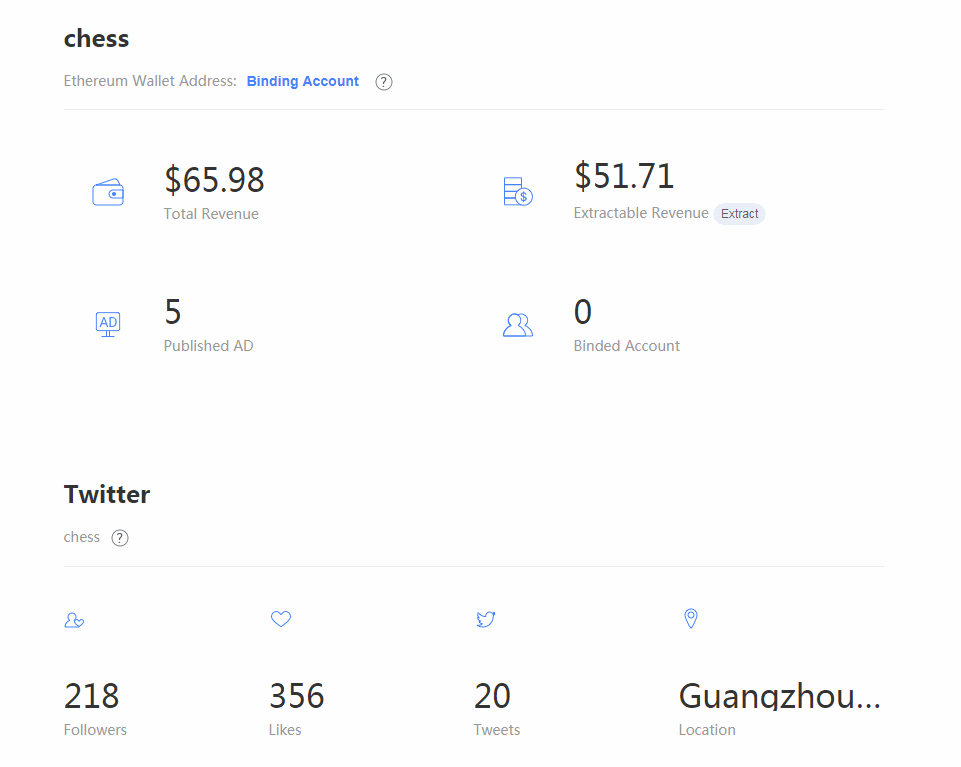

### vue-number-roller

A Vue component of 'Data growth effect'!



### Example

Download number-roller.vue into your vue project

```javascript
<template>
  <div>
    <number-roller
      :num="a"></number-roller>
    <number-roller
      :num="b"
      suffix="%"></number-roller>
    <number-roller
      :num="c"
      :bit="2"
      prefix="$"
      :duration="1000"
      :delay="500"></number-roller>
  </div>
</template>
<script>
export default {
  data () {
    return {
      a: 4884,
      b: 98,
      c: 6.12
    }
  },
  components: {
    NumberRoller: () => import('~/components/number-roller.vue')
  }
}
</script>
```

### Property

  - __num__ [Number, required] data to show
  - __bit__ [Number, 0] decimal digits
  - __prefix__ [String] prefix of data
  - __suffix__ [String] suffix of data
  - __duration__ [Number, 2000] duration of Data growth effect
  - __delay__ [Number, 0] delay of Data growth effect